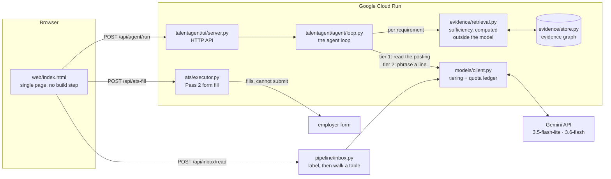

# TalentAgent

An agent that writes job applications it can prove. For each requirement in a posting it searches
what you have actually done, and either writes a line backed by that evidence or asks you a question
— it has no path that lets it invent the difference. It fills the employer's form and stops, because
pressing submit is yours.

Built for the [All Things Agentic Hackathon](https://allthingsagentichackathon.devpost.com/),
category: The Collaborative Partner.

- Live: https://talentagent-482181354691.us-central1.run.app
- Documentation: https://sid-ak.github.io/TalentAgent/

## The idea

Most tools that write applications ask a model to write an application. It is given your resume and a
posting and produces plausible sentences. Some are true, and you cannot tell which, because nothing
in that arrangement separates a fact you supplied from one the model invented to fill a gap.

TalentAgent inverts it. The model never decides whether a line may be written — only how to phrase
one already authorised. Authorisation is a number computed outside the model: for each requirement,
search your evidence, score how well it is covered, compare to a threshold. Above it, the model is
handed a small set of your own entries and asked to phrase one. Below it, there is nothing to phrase,
and you get a question.

So the interesting output of a run is not the bullets. It is the questions.

## Architecture

The load-bearing detail is that `retrieval.py` sits between the posting and the model. Gemini is
asked to phrase evidence that retrieval already approved; it is never asked whether the evidence is
sufficient. That decision is arithmetic, and it is why the system can refuse.

## Quickstart

Requires Python 3.12+ and a [Gemini API key](https://aistudio.google.com/apikey).

1. `git clone https://github.com/sid-ak/TalentAgent && cd TalentAgent`: get the source.
2. `uv sync` (or `python -m venv .venv && .venv/bin/pip install -e ".[dev]"`): install dependencies.
3. `echo 'GEMINI_API_KEY=your-key-here' > .env`: supply the key. It is read from the environment
   first, then from this file; it is gitignored and excluded from the container image.
4. `uv run python scripts/serve_demo.py`: start the server on http://127.0.0.1:8080.
5. Open http://127.0.0.1:8080 and, in order: write a line or two about what you have done, paste a
   job posting, then run the agent.
6. Optionally, fill the employer's form from the result, and paste in the replies an application
   got to see where it stands.

Without a key the server still runs: composition falls back to your own wording used as-is, and the
trace says so rather than pretending.

### Run the tests

1. `uv run pytest -q`: 280 tests, about 1.5 seconds, zero network calls. A socket guard in
   `tests/conftest.py` fails any test that tries to reach a model.
2. `uv run pytest -m guardrail`: just the invariant tests.
3. `uv run ruff check . && uv run mypy`: lint and types.

### Run the container

1. `docker build -t talentagent .`: build the image.
2. `docker run -p 8080:8080 -e HOST=0.0.0.0 -e GEMINI_API_KEY=your-key talentagent`: serve it.

### Deploy to Cloud Run

Requires the `gcloud` CLI, a project with billing enabled, and
`gcloud services enable run.googleapis.com cloudbuild.googleapis.com artifactregistry.googleapis.com`.

1. `gcloud run deploy talentagent --source . --region us-central1 --allow-unauthenticated --max-instances 1 --timeout 300 --memory 1Gi --set-env-vars "GEMINI_API_KEY=$KEY"`: builds
   remotely with Cloud Build and deploys. No local Docker needed.

`--max-instances 1` because the candidate session is a process-wide singleton; a second instance
would split the state. `--timeout 300` because one run is up to nine sequential model calls.

## How the hackathon requirements are met

| Requirement | Where |
|---|---|
| Gemini 3.5 or newer | `gemini-3.5-flash-lite` and `gemini-3.6-flash`, in `talentagent/models/live.py` |
| A Google agent framework | `google-genai` (GenAI SDK), the only model transport |
| A Google Cloud service | Cloud Run, deployed from the `Dockerfile` in this repo |
| Spin-up instructions | Quickstart above |
| Architecture diagram | Above |

## What is built, and what is not

Built and tested: the evidence graph with its attestation classes and the quarantine that keeps
model-inferred claims out of composition; the credited package schema, which rejects an uncredited
line at validation rather than by asking a prompt nicely; per-requirement sufficiency scoring; the
agent loop; the two-pass ATS executor for Greenhouse, Lever, and Ashby, whose page protocol has no
submit method; the domain allowlist and the untrusted-text type.

Also built: reading the replies an application gets. Paste them in and a tier-1 call labels each
one, then the transition table from the specification's Appendix B decides what that does to the
application. The split matters — the model proposes a label from a closed set, and a table it
cannot reach decides the state, so an unrecognised message leaves the application exactly where it
was rather than moving it somewhere invented. `GHOSTED` is unreachable from any message by
construction, because it is derived from elapsed time; a test pins that.

Not built: the five specialist agents the specification describes are still stubs — the only
agentic surface is the loop above. The inbox reader takes pasted text rather than connecting to
Gmail, and it follows one application at a time; thread attribution, the scheduled triggers, and the
silence threshold that produces `GHOSTED` were not built. Nothing scores opportunities and there is
no analyst loop. Guardrail G4 is not enforced, and `/api/status` reports it as `pending` rather than
claiming otherwise. The two-pass executor has never been run against a live posting, only against
fixture forms.

[The plan](docs/TalentAgent-Plan.md) records what each of those would involve, for anyone who
picks the work up.

## Documentation

| Document | Answers |
|---|---|
| [Why](docs/TalentAgent-Why.md) | Why the product exists and what the category gets wrong |
| [Specification](docs/TalentAgent-Spec.md) | Agent contracts, schemas, coordination, guardrails, scope |
| [Architecture](docs/TalentAgent-Architecture.md) | Where things run, what they may reach, how work propagates |
| [Plan](docs/TalentAgent-Plan.md) | The phases, ordered by risk retired |
| [Explanations](docs/explanations/index.md) | One plain-English account per completed phase |
| [Decision records](docs/ADRs/README.md) | Why each load-bearing decision was taken, and what it cost |
| [AGENTS.md](AGENTS.md) | Working agreement for contributors, human and agent |

Build the docs site locally with
`uvx --with-requirements requirements-docs.txt --from mkdocs mkdocs serve`.
