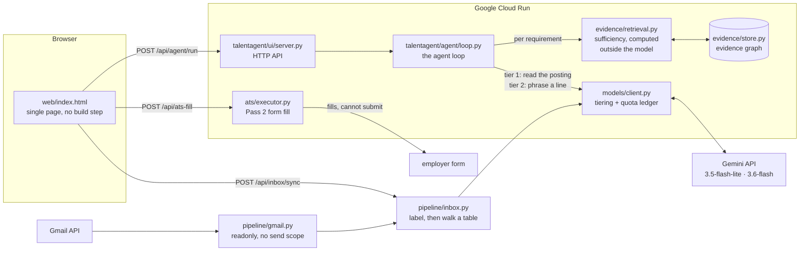

# TalentAgent

An agent that operates a job search as a long-running workflow. It reads a posting, decides which
requirements your evidence can support, refuses the ones it cannot, fills the employer's form, and
reads your inbox to work out where every application stands. Five steps, and only one of them is
text.

Built for the [All Things Agentic Hackathon](https://allthingsagentichackathon.devpost.com/),
category: The Taskmaster.

- Live: https://talentagent-482181354691.us-central1.run.app
- Documentation: https://sid-ak.github.io/TalentAgent/

## The idea

A job search is not a writing problem. Producing an application takes ten minutes and always has.

The bottleneck is everything around it: forty applications in limbo with no idea which are alive, no
memory of what you actually accomplished, no way to tell a bad resume from a bad channel from bad
luck. It is a long-running, stateful workflow with a feedback signal too sparse for anyone to run by
hand — which is why job searches fail slowly, around week six, when the tracker stops being updated.

That is a chore to operate, not a question to answer.

The load-bearing decision is where the model sits. It never decides whether a line may be written —
only how to phrase one already authorised. Authorisation is a number computed outside the model: for
each requirement, search your evidence, score the coverage, compare to a threshold. Above it, the
model is handed a small set of your own entries and asked to phrase one. Below it, there is nothing
to phrase, and the agent routes a question back to you.

So the interesting output of a run is not the bullets. It is the questions — and the fact that your
answer enters the graph verbatim, so the next application starts from more than this one did.

## Architecture



The load-bearing detail is that `retrieval.py` sits between the posting and the model. Gemini is
asked to phrase evidence that retrieval already approved; it is never asked whether the evidence is
sufficient. That decision is arithmetic, and it is why the system can refuse.

## The five steps

1. Ground truth. Upload your resume and it is split into the accomplishments it claims, copied word
   for word — anything not found verbatim in the file is discarded rather than added. You can write
   entries by hand too.
2. It decides. Give it a posting by URL or text. Gemini Flash-Lite separates requirements from
   perks; retrieval and a threshold decide, outside the model, which of them your evidence supports.
   Gemini Flash phrases only those. The rest become questions.
3. It compounds. Your answer to a gap enters the evidence graph verbatim and is available to every
   future application. The system accumulates what is true about you rather than rewriting it.
4. It acts. The composed package is filled onto a real Greenhouse, Lever, or Ashby form, and stops.
5. It tracks. It reads your Gmail read-only, classifies each reply in one batched call, and derives
   application state through a transition table the model cannot reach.

## Quickstart

Requires Python 3.12+ and a [Gemini API key](https://aistudio.google.com/apikey).

1. `git clone https://github.com/sid-ak/TalentAgent && cd TalentAgent`: get the source.
2. `uv sync` (or `python -m venv .venv && .venv/bin/pip install -e ".[dev]"`): install dependencies.
3. `echo 'GEMINI_API_KEY=your-key-here' > .env`: supply the key. It is read from the environment
   first, then from this file; it is gitignored and excluded from the container image.
4. `uv run python scripts/serve_demo.py`: start the server on http://127.0.0.1:8080.
5. Open http://127.0.0.1:8080 and, in order: write a line or two about what you have done, paste a
   job posting, then run the agent.
6. Upload a resume, or paste a Greenhouse, Lever, or Ashby posting URL instead of its text. Other
   hosts are refused by name rather than attempted, including the aggregators whose terms prohibit
   automated access.
7. Fill the employer's form from the result, and read your inbox to see where things stand.

Without a key the server still runs: composition falls back to your own wording used as-is, and the
trace says so rather than pretending.

### Run the tests

1. `uv run pytest -q`: 280 tests, about 1.5 seconds, zero network calls. A socket guard in
   `tests/conftest.py` fails any test that tries to reach a model.
2. `uv run pytest -m guardrail`: just the invariant tests.
3. `uv run ruff check . && uv run mypy`: lint and types.

### Run the container

1. `docker build -t talentagent .`: build the image.
2. `docker run -p 8080:8080 -e HOST=0.0.0.0 -e GEMINI_API_KEY=your-key talentagent`: serve it.

### Connect Gmail

Step 5 reads your mailbox. Without this the surface falls back to pasting replies into a box, and
says so; with it, the paste box disappears on its own.

The scope is `gmail.readonly` and nothing else, so no token this system holds can send mail. Nothing
in the running system can obtain a token either — step 3 is deliberately a command you run, at a
consent screen you see, for access you can revoke.

1. `gcloud services enable gmail.googleapis.com`: turn the API on for your project.
2. In the Google Cloud console, under APIs and services:
    1. OAuth consent screen: User type External, keep publishing status Testing, and add your own
       Google account under Test users. Add the `.../auth/gmail.readonly` scope.
    2. Credentials, Create credentials, OAuth client ID, Application type Desktop app. Note the
       client ID and secret. Desktop app matters — it is what permits the `localhost` redirect the
       next step listens on.
3. `python3 scripts/gmail_auth.py --client-id YOUR_ID --client-secret YOUR_SECRET`: opens the
   consent screen and prints a refresh token. It is standard library only, so no virtualenv is
   needed. You will have to click past an "unverified app" warning, which is what Testing mode
   means.
4. Put all three in `.env`:

    ```
    GMAIL_CLIENT_ID=...
    GMAIL_CLIENT_SECRET=...
    GMAIL_REFRESH_TOKEN=...
    ```

5. Restart the server, or redeploy with the variables set (see below). `GET /api/status` reports
   `gmail_connected`, which is how you tell it worked.

Two limits worth knowing. In Testing mode Google expires refresh tokens after seven days, so this
stops working after a week until you re-run step 3. And a refresh token is bound to the client that
issued it: mixing a token from one OAuth client with another client's ID returns `invalid_grant`.

### Deploy to Cloud Run

Requires the `gcloud` CLI, a project with billing enabled, and
`gcloud services enable run.googleapis.com cloudbuild.googleapis.com artifactregistry.googleapis.com`.

1. `gcloud run deploy talentagent --source . --region us-central1 --allow-unauthenticated --max-instances 1 --timeout 300 --memory 1Gi --set-env-vars "GEMINI_API_KEY=$GEMINI_API_KEY"`:
   builds remotely with Cloud Build and deploys. No local Docker needed.
2. To include Gmail, pass all four. `--set-env-vars` splits on commas, which OAuth values can
   contain, so set a different delimiter with the `^@^` prefix:

    ```
    --set-env-vars "^@^GEMINI_API_KEY=$GEMINI_API_KEY@GMAIL_CLIENT_ID=$GMAIL_CLIENT_ID@GMAIL_CLIENT_SECRET=$GMAIL_CLIENT_SECRET@GMAIL_REFRESH_TOKEN=$GMAIL_REFRESH_TOKEN"
    ```

    Sourcing `.env` first (`set -a; . ./.env; set +a`) keeps the values off your command line and
    out of your shell history.

`--max-instances 1` because the candidate session is a process-wide singleton; a second instance
would split the state. `--timeout 300` because one run is up to nine sequential model calls.

A first deploy on a fresh project fails with a 403 on `storage.objects.get`: the default compute
service account cannot read Cloud Build's source bucket until it is granted
`roles/cloudbuild.builds.builder`, `roles/storage.objectViewer`, `roles/logging.logWriter`, and
`roles/artifactregistry.writer`.

## How the hackathon requirements are met

| Requirement | Where |
|---|---|
| Gemini 3.5 or newer | `gemini-3.5-flash-lite` and `gemini-3.6-flash`, in `talentagent/models/live.py` |
| A Google agent framework | `google-genai` (GenAI SDK), the only model transport |
| A Google Cloud service | Cloud Run, deployed from the `Dockerfile` in this repo; Gmail API for step 5 |
| Spin-up instructions | Quickstart above |
| Architecture diagram | Above |

## What is built, and what is not

Built and tested: the evidence graph with its attestation classes and the quarantine that keeps
model-inferred claims out of composition; the credited package schema, which rejects an uncredited
line at validation rather than by asking a prompt nicely; per-requirement sufficiency scoring; the
agent loop; the two-pass ATS executor for Greenhouse, Lever, and Ashby, whose page protocol has no
submit method; the domain allowlist and the untrusted-text type.

Also built: reading the replies an application gets, from your actual mailbox. A tier-1 call
labels each message, then the transition table from the specification's Appendix B decides what
that does to the application. The split matters — the model proposes a label from a closed set, and
a table it cannot reach decides the state, so an unrecognised message leaves the application exactly
where it was rather than moving it somewhere invented. `GHOSTED` is unreachable from any message by
construction, because it is derived from elapsed time; a test pins that.

The mail connection asks for `gmail.readonly` and nothing else, so no token this system holds can
send anything. Message bodies arrive as `UntrustedText` through the same allowlisted wrapper as
every other outbound read, and an injection attempt in a message halts the read rather than
reaching a model — mail is the most hostile input the system takes.

Not built: the five specialist agents the specification describes are still stubs — the only
agentic surface is the loop above. The inbox reader follows one application at a time; thread
attribution across many applications, the scheduled triggers that would run it without you, and the
silence threshold that produces `GHOSTED` were not built. Nothing scores opportunities and there is
no analyst loop. Guardrail G4 is not enforced, and `/api/status` reports it as `pending` rather than
claiming otherwise. The two-pass executor has never been run against a live posting, only against
fixture forms.

[The plan](docs/TalentAgent-Plan.md) records what each of those would involve, for anyone who
picks the work up.

## Documentation

| Document | Answers |
|---|---|
| [Why](docs/TalentAgent-Why.md) | Why the product exists and what the category gets wrong |
| [Specification](docs/TalentAgent-Spec.md) | Agent contracts, schemas, coordination, guardrails, scope |
| [Architecture](docs/TalentAgent-Architecture.md) | Where things run, what they may reach, how work propagates |
| [Plan](docs/TalentAgent-Plan.md) | The phases, ordered by risk retired |
| [Explanations](docs/explanations/index.md) | One plain-English account per completed phase |
| [Decision records](docs/ADRs/README.md) | Why each load-bearing decision was taken, and what it cost |
| [AGENTS.md](AGENTS.md) | Working agreement for contributors, human and agent |

Build the docs site locally with
`uvx --with-requirements requirements-docs.txt --from mkdocs mkdocs serve`.
