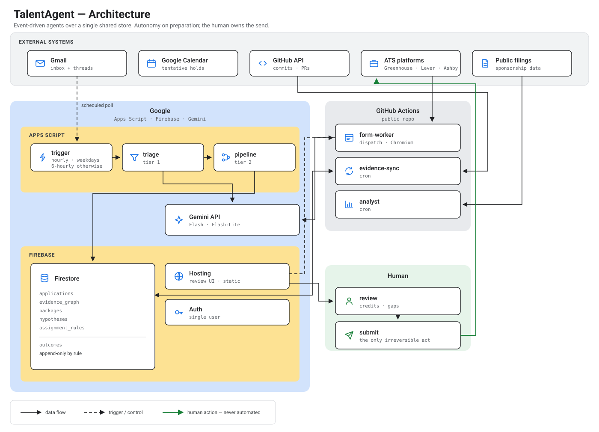
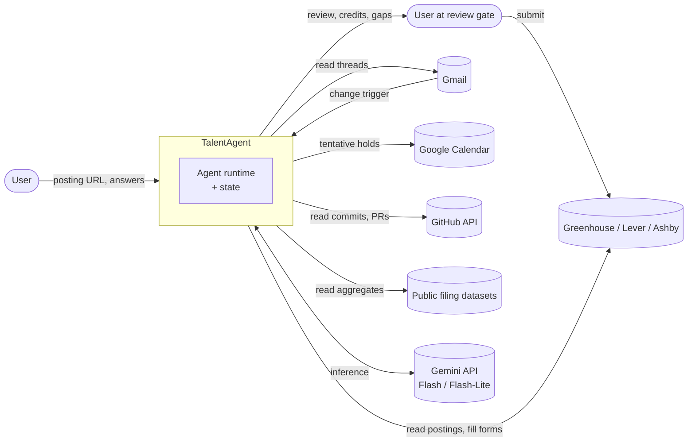
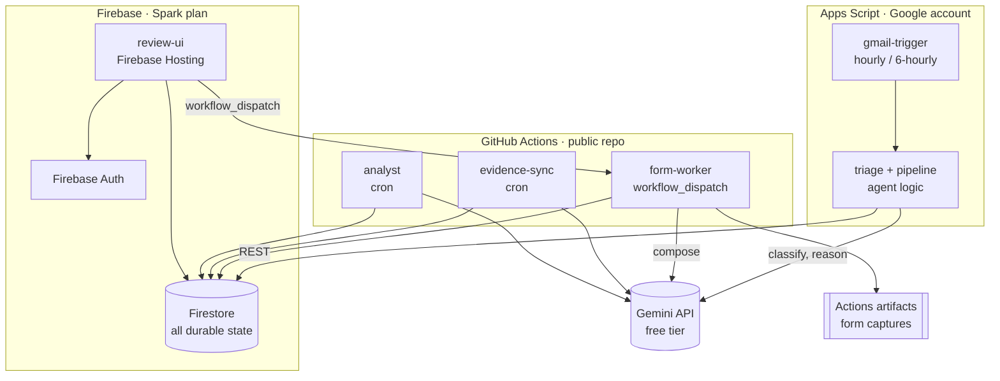
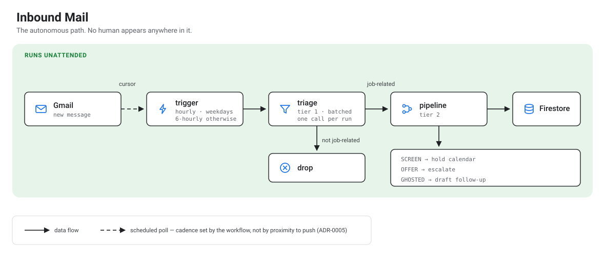
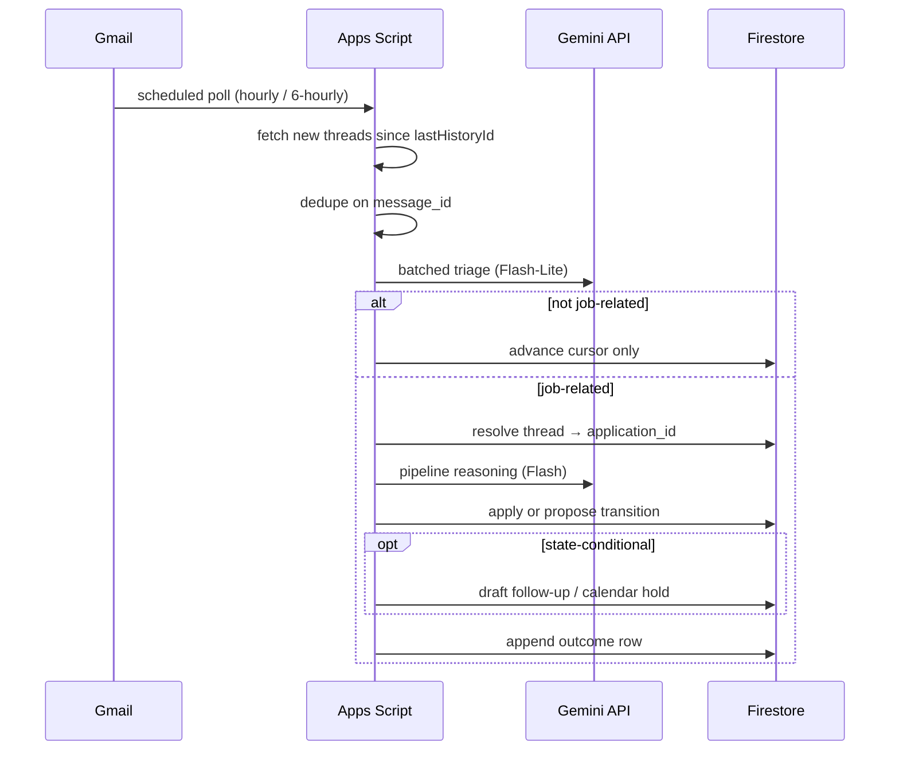
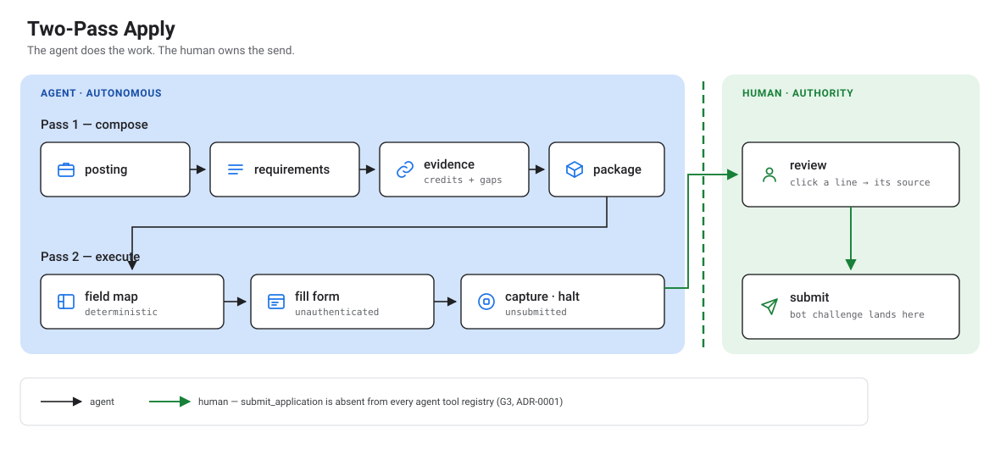
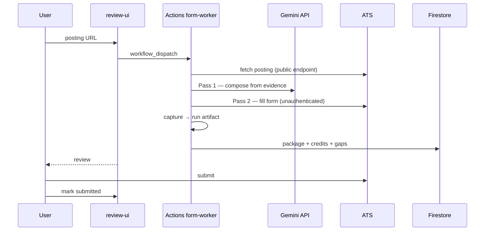
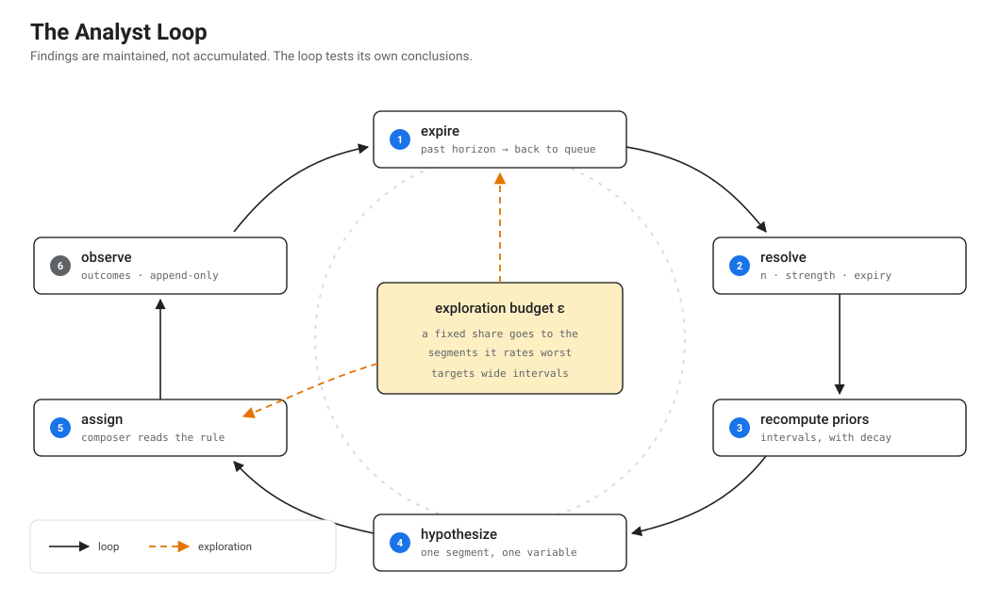
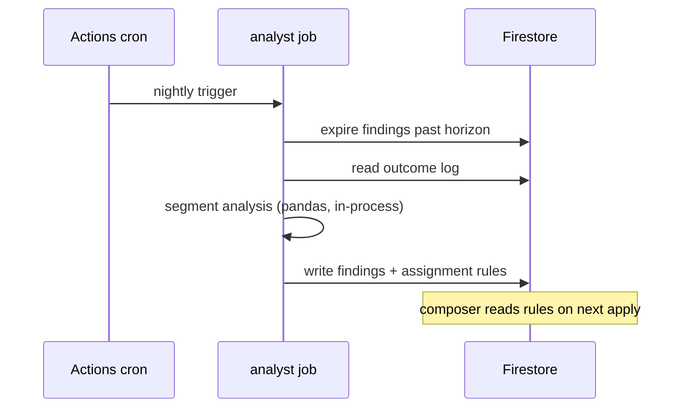

# TalentAgent Architecture

Deployment topology, service boundaries, and runtime data flow for the system defined in [TalentAgent-Spec.md](./TalentAgent-Spec.md). The specification defines agent contracts, schemas, and coordination semantics; this document defines where those run, what they are permitted to reach, and how work propagates between them.

The component choices below are shaped by a zero-budget operating constraint, recorded once in [ADR-0012](./ADRs/0012-zero-budget-constraint.md) and not restated here.

---

## Table of Contents

1. [System Context](#1-system-context)
2. [Component Architecture](#2-component-architecture)
3. [Runtime Paths](#3-runtime-paths)
4. [Component Inventory](#4-component-inventory)
5. [Data Stores](#5-data-stores)
6. [Security Boundaries](#6-security-boundaries)
7. [Failure Handling](#7-failure-handling)
8. [Resource Budget](#8-resource-budget)
9. [Environments and Deployment](#9-environments-and-deployment)
10. [Upgrade Path](#10-upgrade-path)

---

## 1. System Context

> **The architecture diagram.** [`diagrams/00-ARCHITECTURE.svg`](./diagrams/00-ARCHITECTURE.svg) is the single canonical view of the system. Every diagram below details one path within it.

Mermaid source — context view

Two arrows reach the ATS and they are deliberately distinct. TalentAgent reads postings and fills forms, unauthenticated. Only the human submits (Spec §1.4).

---

## 2. Component Architecture

The component view is part of the architecture diagram above. The mermaid source is retained here.

Mermaid source — component view

### 2.1 Why these boundaries

**Apps Script owns the inbound path.** It has native Gmail access and eliminates Gmail `watch()`, Pub/Sub, and the entire OAuth plumbing in one move. The mail path is low-frequency and short-running, which fits Apps Script's execution model and its daily runtime allowance.

**GitHub Actions owns everything long-running.** Runners ship with Chromium, so the form worker needs no container build. Jobs are cron-native, so no scheduler service is required. Runs are free and unlimited on public repositories. Every run leaves logs and retained artifacts, which is an audit trail the design already values.

**Firestore is the only durable store.** At single-user scale the outcome log is hundreds of rows, so a separate analytic warehouse buys nothing (ADR-0012). Immutability is preserved by making the outcome collection append-only in the security rules rather than by using a different product.

**The review UI is static.** All state reads go through the Firestore client SDK under security rules. There is no application server.

### 2.2 What this costs architecturally

The inbound path is scheduled polling, not a push subscription — hourly during weekday working hours, every six hours overnight and at weekends. That is a real departure from the specification's original event model and is recorded in ADR-0005.

The cadence is set by what the workflow needs, not by how close it can get to push. Recruiter replies arrive on a scale of half a day to several days; a worst case of one hour on a weekday is well inside that. The gain is not only cost: at hourly intervals each run finds several messages, so tier-1 classification batches into a single call instead of one per message.

---

## 3. Runtime Paths

### 3.1 Inbound mail

Mermaid source

No human is present in this path. It is the system's autonomy claim.

`lastHistoryId` is the cursor. Combined with per-message idempotency keys, a replayed or overlapping trigger cannot double-advance state (Spec §8.6).

### 3.2 Apply

Mermaid source

The form worker has no code path to submit. The three target platforms accept applications without a candidate account, so no authenticated session exists anywhere in this path.

### 3.3 Scheduled analysis

Mermaid source

Segment analysis runs in-process. At a few hundred outcome rows this is a `groupby`, not a warehouse query.

---

## 4. Component Inventory

| Component | Platform | Trigger | Agents hosted | Capacity basis |
|---|---|---|---|---|
| `gmail-trigger` + `triage`/`pipeline` | Apps Script | Time-driven: hourly weekdays 08–20, 6-hourly otherwise | `triage`, `pipeline` | Free with any Google account |
| `form-worker` | GitHub Actions | `workflow_dispatch` | `composer` | Unlimited on public repos |
| `evidence-sync` | GitHub Actions | `schedule` cron | `evidence` | Unlimited on public repos |
| `analyst` | GitHub Actions | `schedule` cron | `analyst` | Unlimited on public repos |
| `review-ui` | Firebase Hosting | HTTPS | none | Spark plan |

| Resource | Purpose | Capacity basis |
|---|---|---|
| Firestore | All durable state | Spark: 1 GiB, 50k reads / 20k writes per day |
| Firebase Auth | Single-user sign-in to the review UI | Spark |
| Gemini API | Flash and Flash-Lite inference | Free tier, rate-limited |
| Actions artifacts | Form captures, run logs | Retained 90 days |
| Google Apps Script | Inbound trigger and mail-path compute | ~90 min runtime per day |

**Not used:** Cloud Run, Pub/Sub, Cloud Scheduler, Cloud Storage for Firebase, and BigQuery. The reasoning is in ADR-0012.

---

## 5. Data Stores

| Store | Collections | Written by | Read by |
|---|---|---|---|
| Firestore | `applications`, `evidence_graph`, `packages`, `hypotheses`, `assignment_rules`, `outcomes` | Apps Script, Actions jobs, review-ui | All |
| Actions artifacts | Form captures, run logs | `form-worker` | Human, during review |

`outcomes` is append-only by security rule: create is permitted, update and delete are denied for every principal. This preserves the specification's separation of mutable state from immutable history (Spec §11) without a second product.

### 5.1 Write ownership

The single-writer invariant (Spec §2.2) was previously enforced by per-component service accounts. Without Cloud Run there are no service accounts, so enforcement moves to **Firestore security rules keyed to an identity claim carried by each component**, plus schema validation in the rules themselves.

| Path | Writer | Rule |
|---|---|---|
| `applications/*/state`, `timeline` | Apps Script | Write requires the mail-path claim |
| `evidence_graph/*` | `evidence-sync`, review-ui (statement promotion only) | Statement writes require an authenticated user |
| `packages/*` | `form-worker` | Write requires the worker claim |
| `hypotheses/*`, `assignment_rules/*` | `analyst` | Write requires the analyst claim |
| `outcomes/*` | Apps Script, `analyst` | Create only; no update or delete |

This is weaker than IAM. Rules are enforced server-side by Firestore and are adequate for a single-user deployment, but the guarantee is a configuration guarantee rather than an infrastructure one. Recorded honestly in ADR-0012.

---

## 6. Security Boundaries

### 6.1 Credentials

| Credential | Held by | Notes |
|---|---|---|
| Gmail, Calendar access | Apps Script | Bound to the owning Google account; no token leaves Google |
| GitHub API token | Actions secret | Scoped read-only to the user's repositories |
| Gemini API key | Actions secret, Script property | Rate-limited free-tier key |
| ATS credentials | **None exist** | Target platforms need no account (ADR-0010) |

No component reads, stores, or transmits a password, and no code path creates an account. Extending to a platform requiring authentication needs the delegation mechanism recorded in Spec §15.1.

### 6.2 Egress control

Network-layer egress restriction is not available on Actions runners or Apps Script. Guardrail G5 therefore moves from an infrastructure control to an application-layer allowlist check in the fetch wrapper, asserted in tests. This is a genuine weakening relative to the Cloud Run design and is the clearest reason to migrate if credits later become available (§10).

### 6.3 Untrusted input

Unchanged. Postings, inbound messages, and ATS page content are third-party text, entering as data fields and never as instruction context. Detected injection attempts are logged and the workflow instance halts.

### 6.4 Repository visibility

Actions minutes are unlimited only on public repositories, so the repository is public. Consequences: no secret may ever be committed, all credentials live in Actions secrets, and fixtures must contain no personal data. The mail corpus and evidence seed are anonymized before commit.

---

## 7. Failure Handling

| Failure | Handling |
|---|---|
| Overlapping or missed Apps Script runs | `lastHistoryId` cursor plus per-message idempotency key; a missed run is absorbed by the next, which simply finds a larger batch |
| Gemini rate limit (RPM) | Exponential backoff within the run; work resumes on the next trigger |
| Gemini daily quota exhausted | Mail path degrades to cursor-advance only and retries next day; surfaced in the activity feed rather than failing silently |
| Apps Script 6-minute execution limit | Batch size capped per run; unprocessed messages remain behind the cursor and are picked up next run |
| Actions run failure | Standard retry; run logs retained as the audit record |
| ATS DOM change | Field map miss recorded per field; run halts with partial capture rather than guessing |
| Low classification confidence | Transition proposed, not applied (Spec §4.3) |
| Firestore daily quota exhausted | Writes fail closed until the quota resets |

Every failure above degrades or halts rather than escalating. A runaway loop exhausts a quota and stops.

---

## 8. Resource Budget

Estimated single-user daily load against free-tier ceilings.

| Resource | Ceiling | Estimated use | Margin |
|---|---|---|---|
| Firestore reads | 50,000 / day | ~2,000 | 25× |
| Firestore writes | 20,000 / day | ~500 | 40× |
| Firestore storage | 1 GiB | < 50 MiB | 20× |
| Gemini Flash | 250 requests / day | ~110 | **2×** |
| Gemini Flash-Lite | 1,000 requests / day | ~40 | 25× |
| Actions minutes | Unlimited (public repo) | ~60 min/day | n/a |
| Apps Script runtime | ~90 min / day | ~3 min (14 runs on a weekday) | 30× |

**The binding constraint is the Gemini Flash daily quota**, and development consumes it faster than operation does.

Widening the mail cadence (§2.2) largely removed two other pressures — Apps Script runtime and Flash-Lite consumption, since triage now batches — but it barely touches Flash. Tier-2 usage is dominated by composition, not by the mail path, so the tight margin stays where it was. Two mitigations, both required rather than optional:

1. **Golden-fixture responses.** Model outputs are recorded once and replayed in tests. The test suite makes zero API calls. This is also what makes the suite deterministic.
2. **Tier down aggressively.** Triage runs on Flash-Lite, which has a 4× larger allowance. Self-hosting a small Gemma classifier in the Actions runner is the further step if the Flash-Lite budget tightens (ADR-0006).

---

## 9. Environments and Deployment

| Environment | Purpose | External access |
|---|---|---|
| `local` | Fixture-driven development | ATS fixtures only; Firestore emulator; recorded model responses |
| `prod` | Single-user operation | Full |

There is no staging environment. A second Firebase project would consume a second Spark quota and add no signal that fixtures do not already provide.

Deployment is one command plus two manual steps: `firebase deploy` for rules and hosting; `clasp push` for the Apps Script project; Actions workflows deploy by being committed. Trigger installation and API-key entry are manual one-time steps, documented in the README.

---

## 10. Upgrade Path

If the budget constraint lifts (ADR-0012), the migration is bounded and does not touch agent logic:

| Move | From | To | Regains |
|---|---|---|---|
| Ingress | Apps Script scheduled trigger | Gmail `watch()` → Pub/Sub → Cloud Run | True push semantics; ADR-0005's original claim |
| Jobs | Actions cron | Cloud Run jobs + Cloud Scheduler | Co-location with state; per-job IAM |
| Write ownership | Firestore rules | Per-component service accounts | Infrastructure-enforced single-writer |
| Egress control | Application-layer allowlist | VPC egress policy | Infrastructure-enforced G5 |
| Artifacts | Actions artifacts | Cloud Storage | Retention beyond 90 days |

Agent contracts, schemas, and coordination semantics are unchanged by any row in this table, which is the point of specifying them independently of topology.
