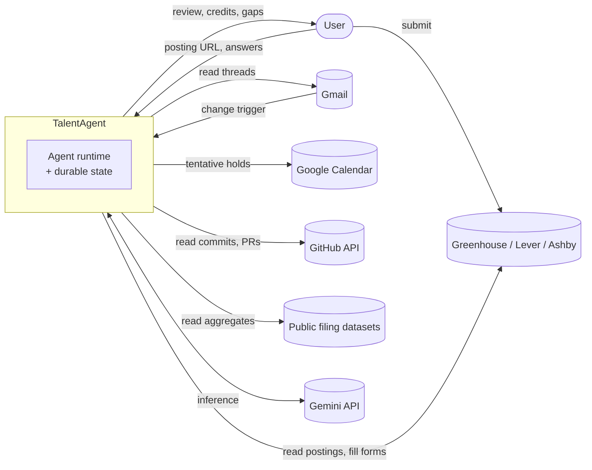

# TalentAgent

TalentAgent is the agent your career never had: it works while you sleep, backs every resume claim
with real work, and learns which employers actually hire people like you.

It is designed as an event-driven multi-agent system that treats a job search as what it actually
is — a long-running, stateful workflow with a feedback signal too sparse and too delayed for any
person to run properly by hand. Five specialist agents maintain a graph of what you have really
done, derive your application pipeline from your inbox rather than from a form you fill in, compose
applications in which every generated line traces back to evidence you originated, and run a closed
experiment loop over your outcomes.

That is the design. What runs today is the third of those: a single agent loop that composes
credited applications from evidence you supply, asks you a question wherever the evidence runs out,
and fills an employer's form without being able to submit it. It also reads the replies an
application gets and derives where it stands. The autonomous inbox pipeline and the analyst loop
were never built; [the plan](TalentAgent-Plan.md) records what they would involve. The
[Phase 2.5 explanation](explanations/phase-2.5-demo.md) describes what exists in plain English.

The system acts on its own for preparation, tracking, and analysis. It never takes an action that
asserts your identity — no account creation, no authentication, and no submission. Those stay with
you, on purpose.

---

## Start here

- :material-help-circle-outline: [Why](TalentAgent-Why.md)

    The problem, why the four existing product archetypes each miss it, and what closing the loop
    would actually look like. Start here if you want the argument before the machinery.

- :material-file-document-outline: [Specification](TalentAgent-Spec.md)

    Agent contracts, schemas, coordination semantics, the tool surface, the guardrails, and the
    scope boundary. This is the source of truth for behaviour.

- :material-sitemap-outline: [Architecture](TalentAgent-Architecture.md)

    Where each agent runs, what it is permitted to reach, how work propagates, and what the
    zero-budget constraint cost the design. The source of truth for topology.

- :material-map-outline: [Plan](TalentAgent-Plan.md)

    Five phases, ordered by risk retired rather than by feature area, each ending at a gate. Mirrors
    the GitHub milestones and issues.

- :material-scale-balance: [Decision records](ADRs/README.md)

    Twelve records covering the decisions that would be expensive to reverse — what the context was,
    what was decided, and what it cost.

---

## The shape of the system

Two arrows reach the applicant tracking system and they are deliberately different. TalentAgent
reads postings and fills forms. Only the human submits.

---

## What it does

### The Evidence Locker

A running record of what you have actually done — the work, the scale, the result, and what backs
each claim up. Where your work is public it is read directly. Where it is not, and that is the usual
case, the record grows from your own words, asked for one question at a time when a specific job
exposes a specific gap.

Each claim is labelled by how strongly it is backed: publicly verifiable, privately held, or
asserted by you. The guarantee is narrow and complete — the tool never invents a claim you did not
make, and it always tells you which kind of ground a line is standing on.

### The Pipeline Keeper

Watches the inbox and moves each application along, with no user action. It notices silence on its
own, drafts the follow-up, and holds the calendar time. You never open an app to keep it current,
because it keeps itself current from the truth.

### Grounded apply, with credits

Given a posting, it does the whole application — matches every requirement to evidence, writes the
materials, answers the screening questions, fills the form. Then it stops. You get a review where
every line is clickable through to the thing that justifies it, and anything it could not support is
flagged rather than invented.

### The Analyst

Runs overnight across your outcomes. It does not summarise; it forms a hypothesis, proposes a
specific experiment, waits, and reports whether the experiment worked. Findings carry how much data
they rest on and an expiry date, so conclusions stay testable instead of hardening into
superstition — which is the exact failure this tool exists to fix.

---

## The two ideas doing the most work

Eligibility is a fact about the world; your outcome history is an estimate about you. The first is
sourced from public filings and is true regardless of anything you did, so it is allowed to exclude
an opportunity. The second comes from your own small, biased, ageing sample, so it is allowed to
reorder one and nothing more. Nothing is ever hidden from you on the strength of your own history.

Generation is constrained by an evidence base rather than by instruction. A model handed a job
description and a thin profile and told to produce a compelling match will manufacture the match;
that is structural, not a defect a better model fixes. So the composer may only select and phrase
what is already in the graph, and a line without a valid credit fails schema validation before it
ever reaches you.
